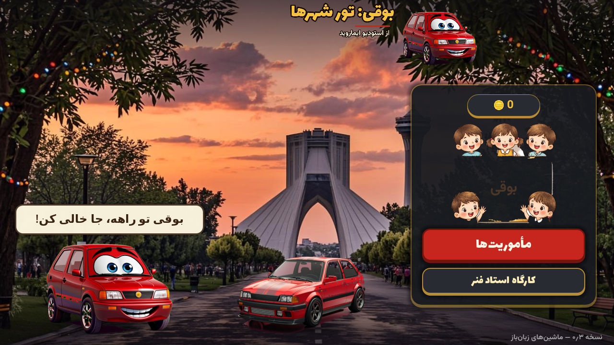
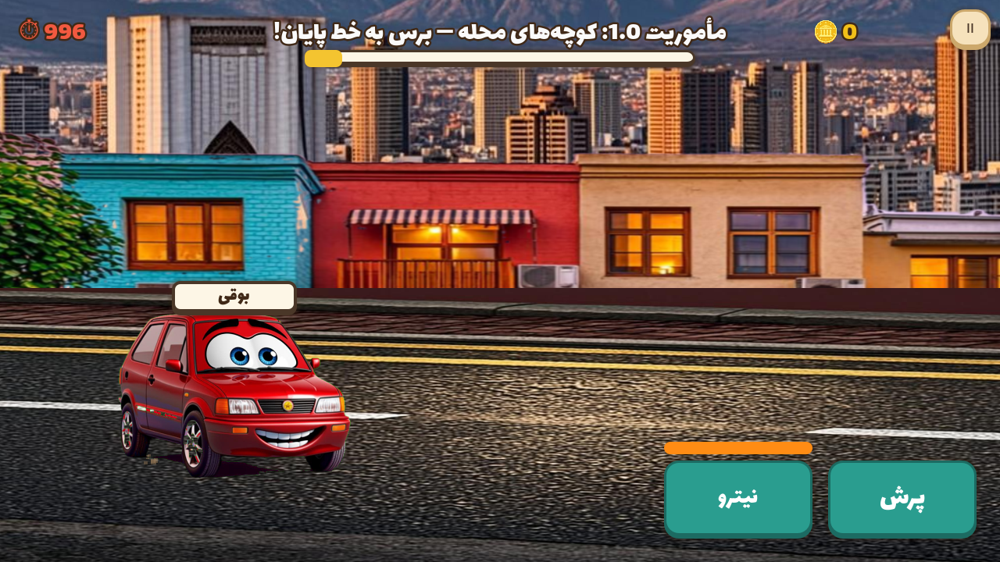
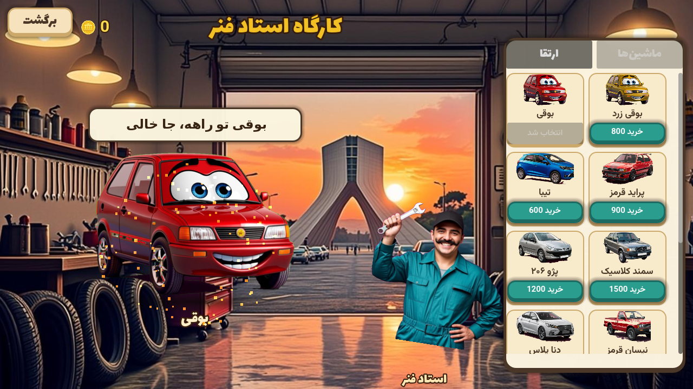

# بوقی: تور شهرها 🚗 — Boghi: City Tour

<p align="center">
  
</p>

بازی موبایل کارتینگ فانتزی با **ماشین‌های زنده** — ساخته‌شده با Godot 4.7.2 برای اندروید و ویندوز.

<p align="center">
  
</p>

## ویژگی‌ها
- **فصل ۱: تهران** — ۵۰ مأموریت که به‌صورت ریموت از سرور دریافت می‌شوند (JSON)
- **۱۲ ماشین ایرانی زنده**: بوقی قرمز، بوقی زرد، پراید، تیبا، پژو ۲۰۶، سمند، دنا، نیسان، شاهین، کوییک و دو مسابقه‌ای قرمز
- **ماشین‌های زبان‌باز**: هر ماشین شخصیت، لقب، انیمیشن تنفس و صدای مخصوص خودش را دارد؛ بوقی شیطون وسط منو فریاد می‌زند «منو انتخاب کن!»
- **چشم‌ها و لبخندهای واقعی** روی ماشین‌های شخصیت (سبک انیمیشن‌های معروف ماشین‌های زنده)
- **نیترو** با شعله آتشین، گیج و دکمه — و بوست مخفی که فقط سیستم طرفدار بوقی است
- **کارگاه استاد فنر** — فقط سیبیل! با انیمیشن واقعی کار (آچار، جرقه، صدا)
- **پلاک ماشین** با اسم خودت
- **اقتصاد سکه‌ای** + آپگرید (فنر، موتور، لاستیک) + خرید ماشین
- **معماری وایت‌لیبل**: تغییر زبان/شخصیت‌ها فقط با جایگزینی پکیج (خروج بین‌المللی)
- فونت‌های فارسی: Lalezar + Vazirmatn

## دانلود APK
لینک مستقیم نسخه فعلی (اندروید ۷ به بالا):

**https://github.com/ldrcoir/boghi-city-tour/releases/download/v0.4/BoghiCityTour_v0.4_test.apk**

یا از صفحه [Releases](https://github.com/ldrcoir/boghi-city-tour/releases/latest) آخرین نسخه را بگیرید.

## تصاویر بازی
| گیم‌پلی | کارگاه استاد فنر |
|:---:|:---:|
|  |  |

## ساخت از سورس
```bash
godot --path game --import
godot --headless --path game --export-debug "Android" BoghiCityTour.apk
```
پیش‌نیاز: قالب اکسپورت Godot 4.7.2 + Android SDK (build-tools 34) + JDK 21.

## ساختار
```
game/            سورس گودوت (صحنه‌ها، اسکریپت‌ها، اسپرایت‌ها)
docs/            صفحه GitHub Pages (لندینگ فارسی RTL) + تصاویر
```

## امنیت
- توکن‌ها هرگز در ریپو ذخیره نمی‌شوند؛ APKها فقط به‌صورت Release Asset منتشر می‌شوند.
